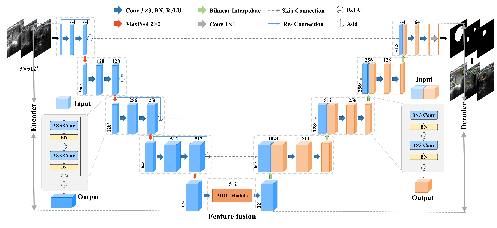

# MRU-Net
MRU-Net：Multi-branch expanded residual U-Net framework for thyroid ultrasound nodule image segmentation.

## Environment Configuration:
* Python3.6/3.7/3.8
* Pytorch1.10
* Windows
* Best to use GPU training.
* Detailed environment configuration as show in `requirements.txt`.

## File Structure：
```
  ├── src: MRU-Net model code.
  ├── train_utils: Training, validation-related modules.
  ├── augmentation.py: Data Augmentation Related Modules.
  └── train.py: Training with a single GPU.
```

## Download the TN3K dataset：
* Official Address： [https://github.com/haifangong/TRFE-Net-for-thyroid-nodule-segmentation/tree/main/picture] 

## MRU-Net structure：

